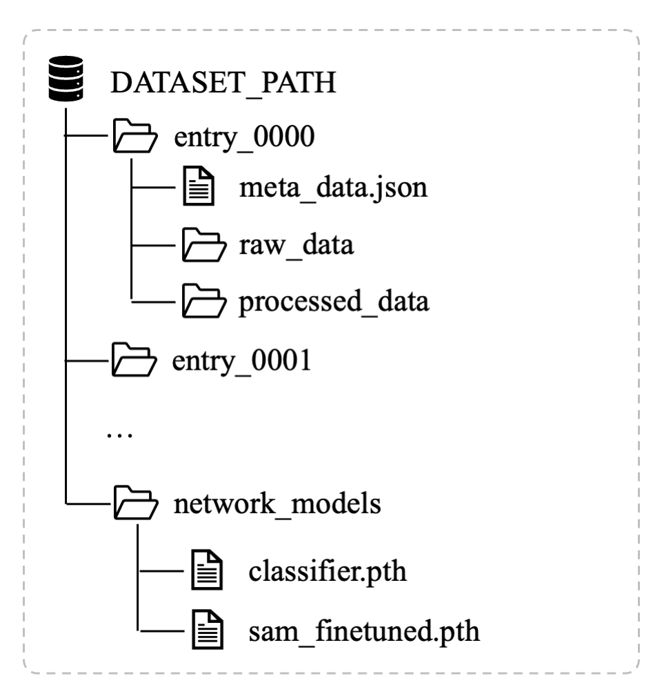

# CoralSpec-30M-DatasetProcessing
Scripts for mask generation and processing of the CoralSpec-30M coral spectral dataset.


## Generate Masks with Trained Networks

### Environment

We use **Python 3.11.7**, and the required packages are listed in `requirements.txt`.  
You can create a new environment and install the dependencies as follows:

```
   conda create -n coral_sam python=3.11.7 -y
   conda activate coral_sam
   pip install -r requirements.txt
```

### Steps
1. Download the dataset from the [CoralSpec-30M data repository](https://doi.org/10.25781/KAUST-5481Z). We use DATASET_PATH to denote the path to the parent directory of the dataset.
   The full dataset consists of 1,286 folders, packaged into 26 zip archives (`coralspec_30m_x.zip`, x is a number).  
   You may download only the first zip file for testing or as a small-scale example.
   You may need to grant write permission to all unzipped files: 
```
   chmod -R u+w $DATASET_PATH
```

2. Download the pretrained network models (`network_models.zip`) and extract them.  
   Place the extracted folder in the **same parent directory** as the dataset, i.e. $DATASET_PATH.
   
   An example directory structure is shown below:

<p align="center">
   
</p>

3. In `run.sh`, set the `DATASET_PATH` variable to this parent directory.

4. Run:
   ```bash
   bash run.sh
    ```

This will generate coral masks and store the processed results in the processed_data directory of each entry.
Logs and intermediate results will be stored under $DATASET_PATH/tensorboard_logs. You can visualize them using TensorBoard:
```bash
   tensorboard --logdir $DATASET_PATH/tensorboard_logs
```

## Citation
If you find this dataset or code useful in your research, please cite:

```
@misc{https://doi.org/10.25781/kaust-5481z,
  doi = {10.25781/KAUST-5481Z},
  url = {https://repository.kaust.edu.sa/handle/10754/707619},
  author = {Kang,  Kaizhang and Heidrich,  Wolfgang},
  title = {CoralSpec-30M},
  publisher = {KAUST Research Repository},
  year = {2025}
}
```
