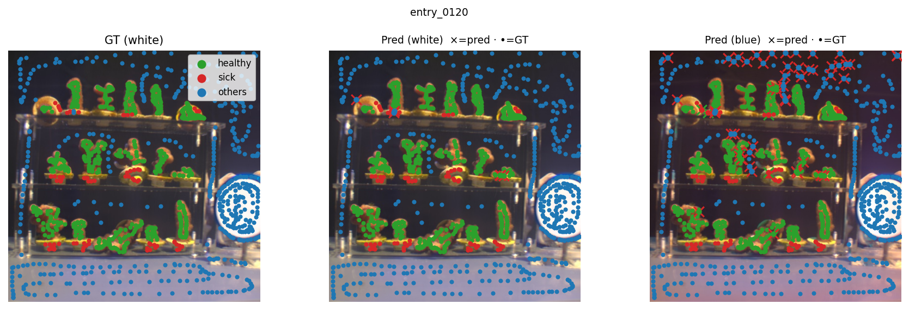
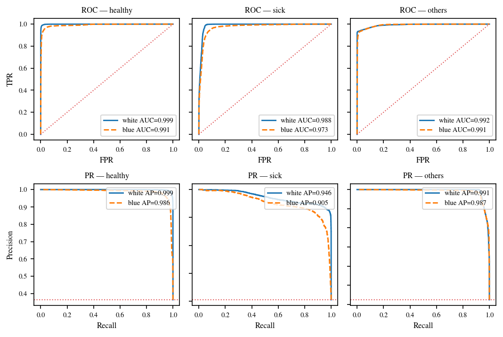
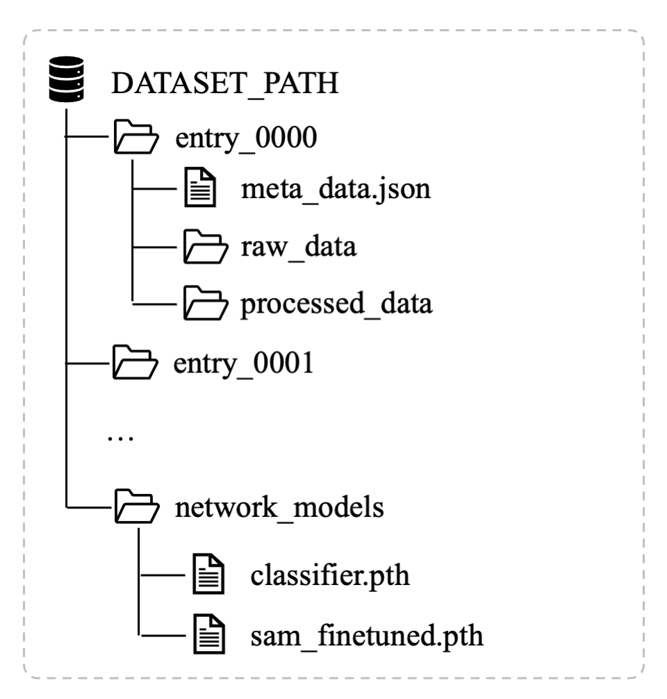

# CoralSpec-30M-DatasetProcessing
Scripts for mask generation and processing of the CoralSpec-30M coral spectral dataset.

## Updates

**[2026-06]** We added `classifier_evaluation.py` to `run.sh`. This script evaluates the coral health classifier on all annotated entries in the dataset. After running, a new folder `eval_classifier/` is created under `$DATASET_PATH` with the following outputs:

- **Per-entry visualizations** (one `.png` per annotated entry): three side-by-side panels showing the ground-truth labels, the classifier predictions under white illumination, and the predictions under the corresponding lighting condition described in the paper (see [figures/entry_0120_vis.png](figures/entry_0120_vis.png) for an example). Note that background predictions under blue light may appear unstable — the classifier was trained exclusively on white-light data, so blue-illuminated background spectra are out-of-distribution.

<p align="center">
  
</p>

- **Dataset-level statistics**: confusion matrix, per-class precision/recall/F1, and overall accuracy, saved to `$DATASET_PATH/eval_classifier/eval_results.txt` (human-readable) and `$DATASET_PATH/eval_classifier/eval_results.json` (machine-readable).

- **ROC and PR curves** across all annotated pixels (see [figures/roc_pr.png](figures/roc_pr.png) for an example).

<p align="center">
  
</p>

## Generate Masks with Trained Networks

### Environment

We use **Python 3.11.7**, and the required packages are listed in `requirements.txt`.  
You can create a new environment and install the dependencies as follows:

```
   conda create -n coral_sam python=3.11.7 -y
   conda activate coral_sam
   pip install -r requirements.txt
```

### Steps
1. Download the dataset from the [CoralSpec-30M data repository](https://doi.org/10.25781/KAUST-5481Z). We recommend using [Globus Connect Personal](https://www.globus.org/globus-connect-personal) for downloading the dataset. For users who are unfamiliar with Globus, we provide download instructions [here](https://github.com/cocoakang/CoralSpec-30M-DatasetProcessing/blob/main/dataset_download_instruction.md). In some network environments, especially when downloading files directly through the web download button, users may encounter an "Internal Server Error", which may be caused by strict firewall settings.

  We also provide a [mirror site](https://huggingface.co/datasets/cocoakang/CoralSpec-30M) on Hugging Face for users who continue to experience access problems with Globus.

  After downloading, the full dataset consists of 1,286 folders, packaged into 26 zip archives (`coralspec_30m_x.zip`, x is a number). Users may download only the first zip file for testing or as a small-scale example. We use `DATASET_PATH` to denote the path to the parent directory of the dataset. Please extract all zip archives into `$DATASET_PATH`, for example:
```bash
   unzip "*.zip" -d "$DATASET_PATH"
```
   
   You may need to grant write permission to all unzipped files: 
```
   chmod -R u+w "$DATASET_PATH"
```

2. Download the pretrained network models (`network_models.zip`) and extract them.  
   Place the extracted folder in the **same parent directory** as the dataset, i.e. $DATASET_PATH.
   
   An example directory structure is shown below:

<p align="center">
   
</p>

3. In `run.sh`, set the `DATASET_PATH` variable to this parent directory.

4. Run:
   ```bash
   bash run.sh
    ```

This will generate coral masks and store the processed results in the processed_data directory of each entry.
Logs and intermediate results will be stored under $DATASET_PATH/tensorboard_logs. You can visualize them using TensorBoard:
```bash
   tensorboard --logdir $DATASET_PATH/tensorboard_logs
```

## Citation
If you find this dataset or code useful in your research, please cite:

```
@misc{https://doi.org/10.25781/kaust-5481z,
  doi = {10.25781/KAUST-5481Z},
  url = {https://repository.kaust.edu.sa/handle/10754/707619},
  author = {Kang,  Kaizhang and Heidrich,  Wolfgang},
  title = {CoralSpec-30M},
  publisher = {KAUST Research Repository},
  year = {2025}
}
```
