# Dataset Download Instruction

Our dataset is hosted on three sites:

- [KAUST Library](https://repository.kaust.edu.sa/items/581bd796-dad1-4b44-9fc1-9d1f584e100f)
- [Zenodo (Mirror)](https://zenodo.org/records/19561737)
- [Hugging Face (Mirror)](https://huggingface.co/datasets/cocoakang/CoralSpec-30M)

Zenodo and Hugging Face support direct download through a web browser. Download speed may vary significantly depending on your location and network conditions. If you encounter download issues or slow transfer speeds on one platform, please try another source.

## Download From Hugging Face

Please navigate to the **Files and versions** tab and click the download icon for the file you would like to download.

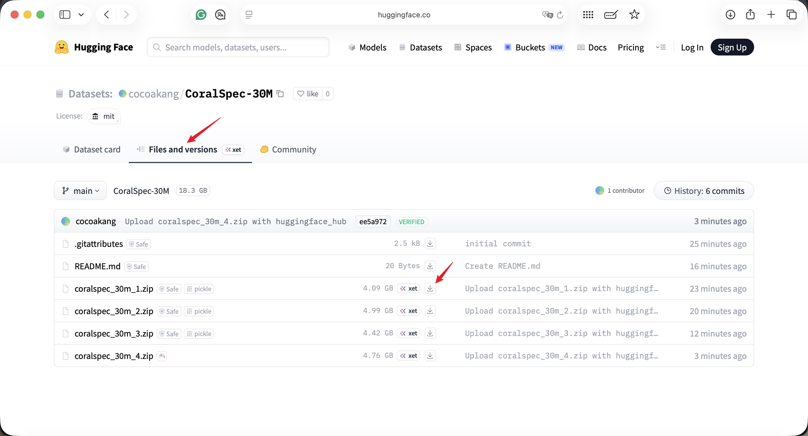

## Download From Zenodo

Please click the **Download** button next to the file you would like to download.

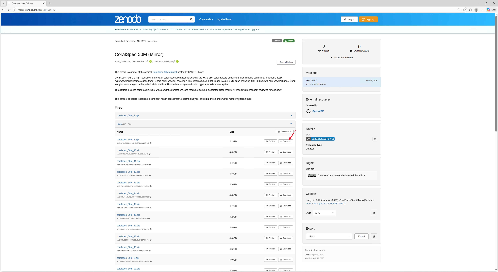

## Download From KAUST Library

The original dataset is hosted by the KAUST Library and can be accessed through **Globus**.

### Option 1: Download through the browser

Please open the KAUST dataset page and click **Link to Globus download directory**.

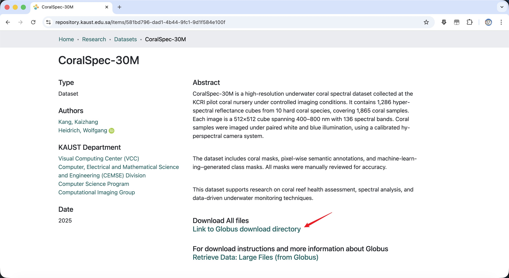

Please sign in to Globus if prompted. After login, you may download a file directly through the browser.

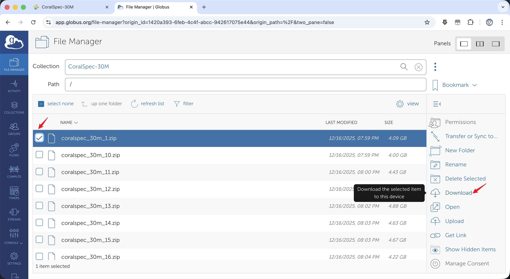

Please note that browser download supports only **one file at a time** and may be unreliable for large files or unstable network conditions.

If browser download does not work, please use **Globus Connect Personal** instead.

### Option 2: Download through Globus Connect Personal

For large files or multiple-file transfer, we recommend using **Globus Connect Personal**.

1. Please download and install Globus Connect Personal from the official website:  
   [https://www.globus.org/globus-connect-personal](https://www.globus.org/globus-connect-personal)

2. Please sign in with the same account used in the Globus web interface.

3. Please set up your local collection and keep Globus Connect Personal running.

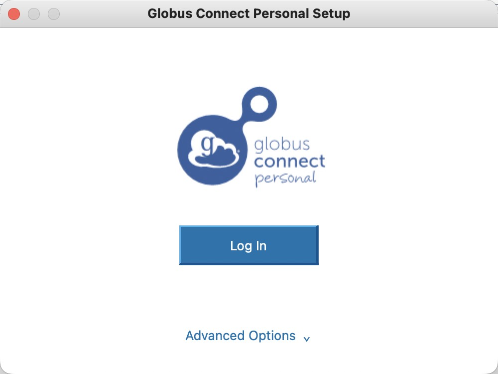
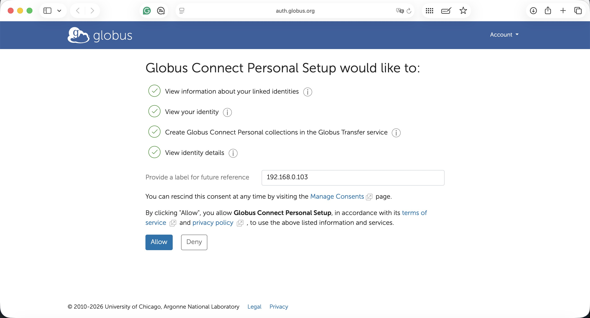
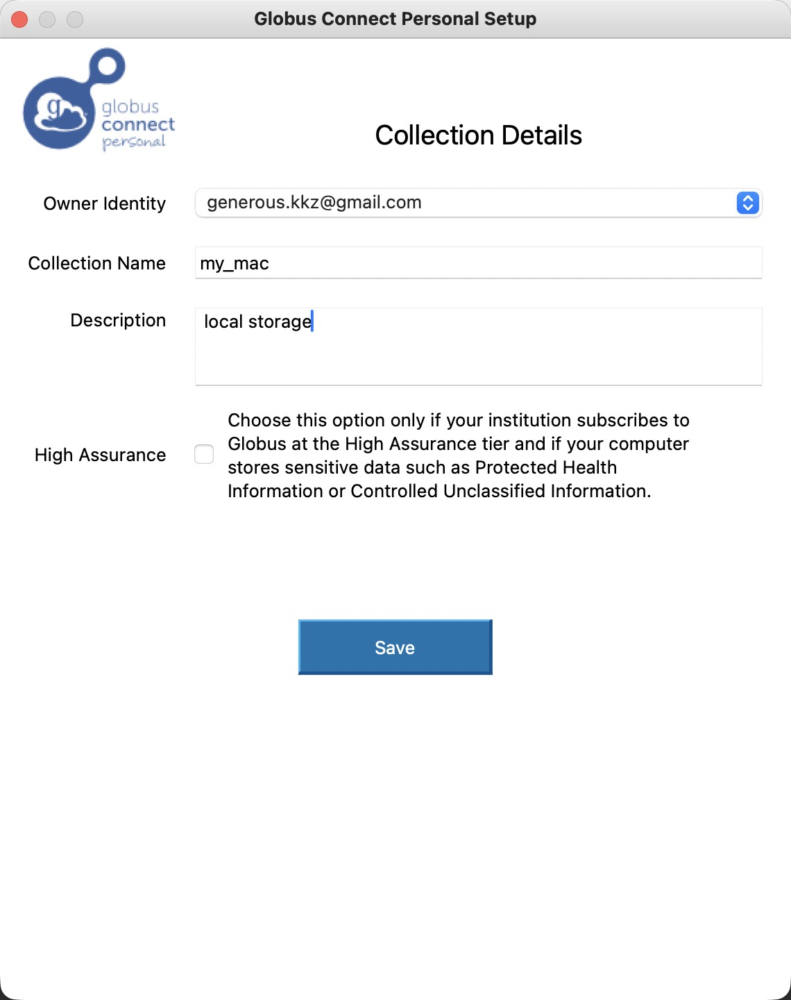

4. Please return to the Globus web app, search for your local collection, and open it.

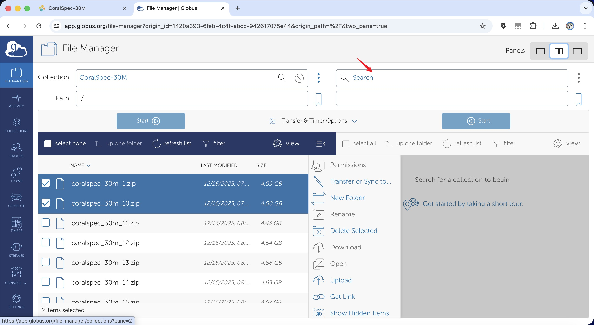
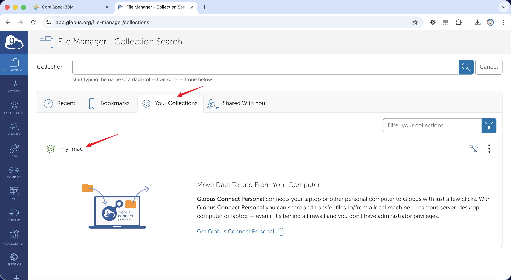

5. Please select one or more dataset files and click **Start** to begin the transfer.

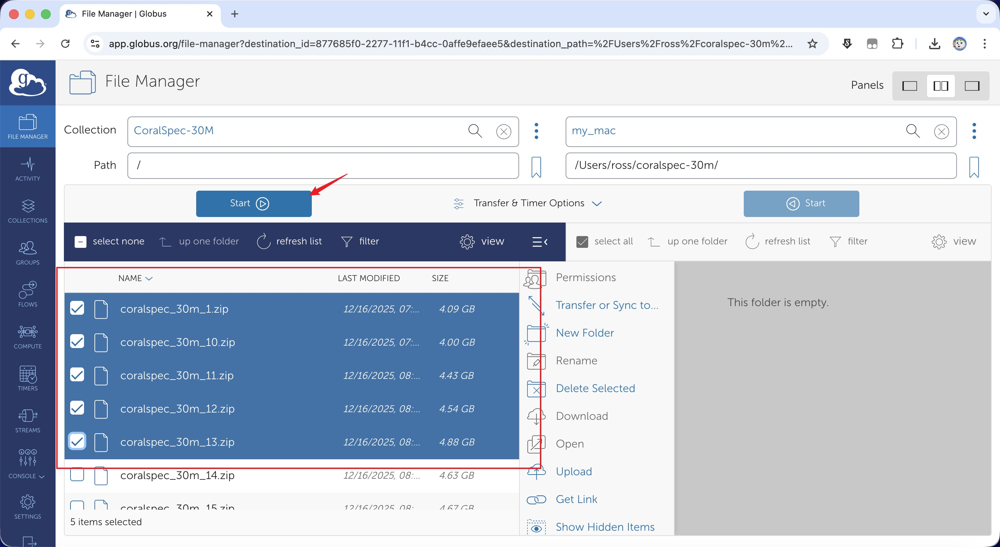

6. Please open **Activity** to monitor the transfer progress.

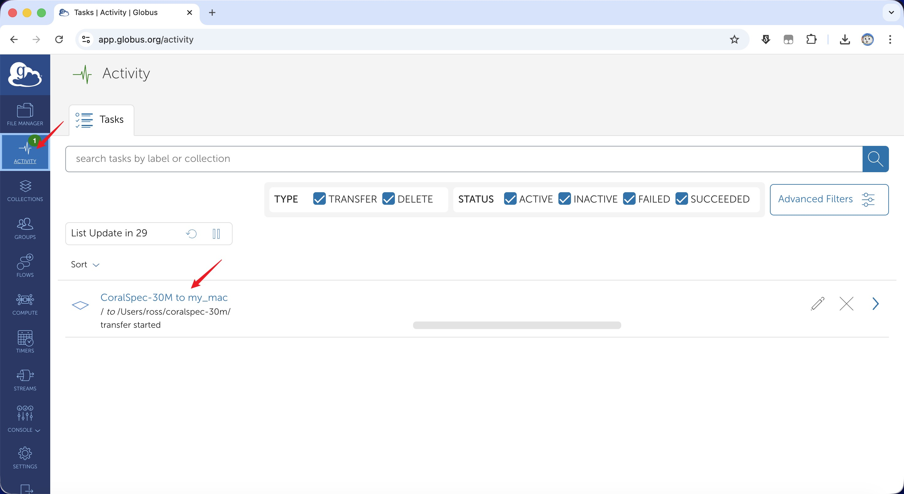

If you encounter issues with the KAUST Library / Globus route, please use the Zenodo or Hugging Face mirror instead.
