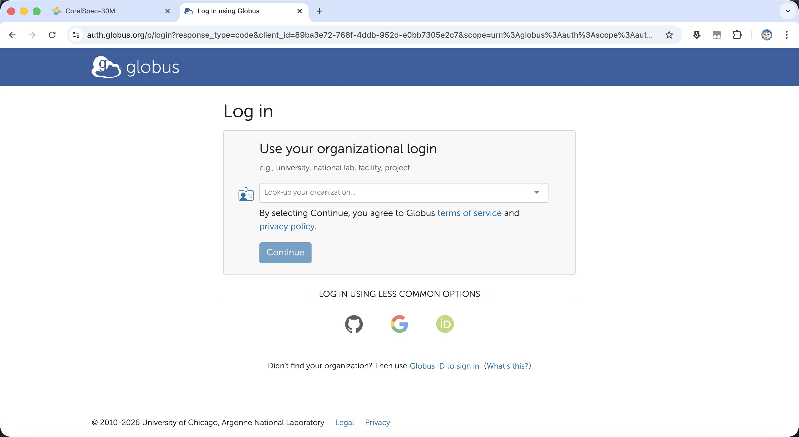
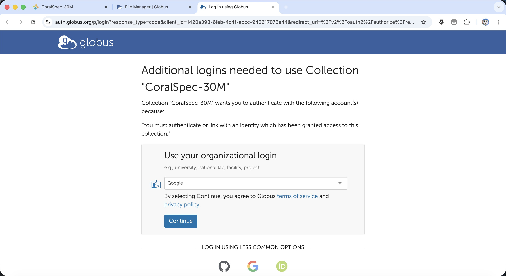
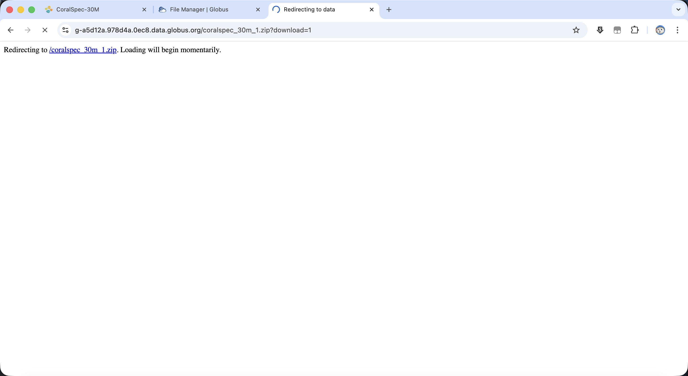
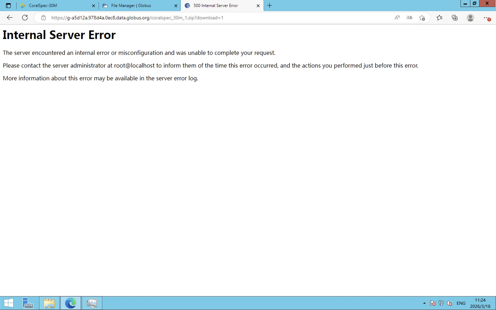
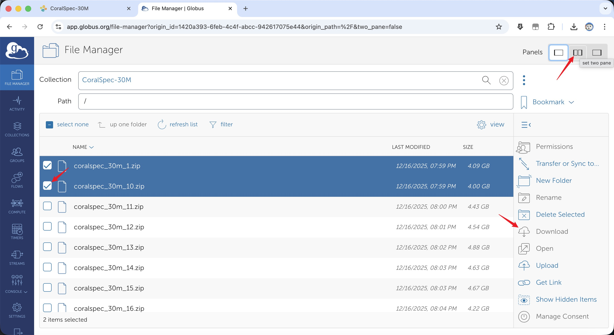
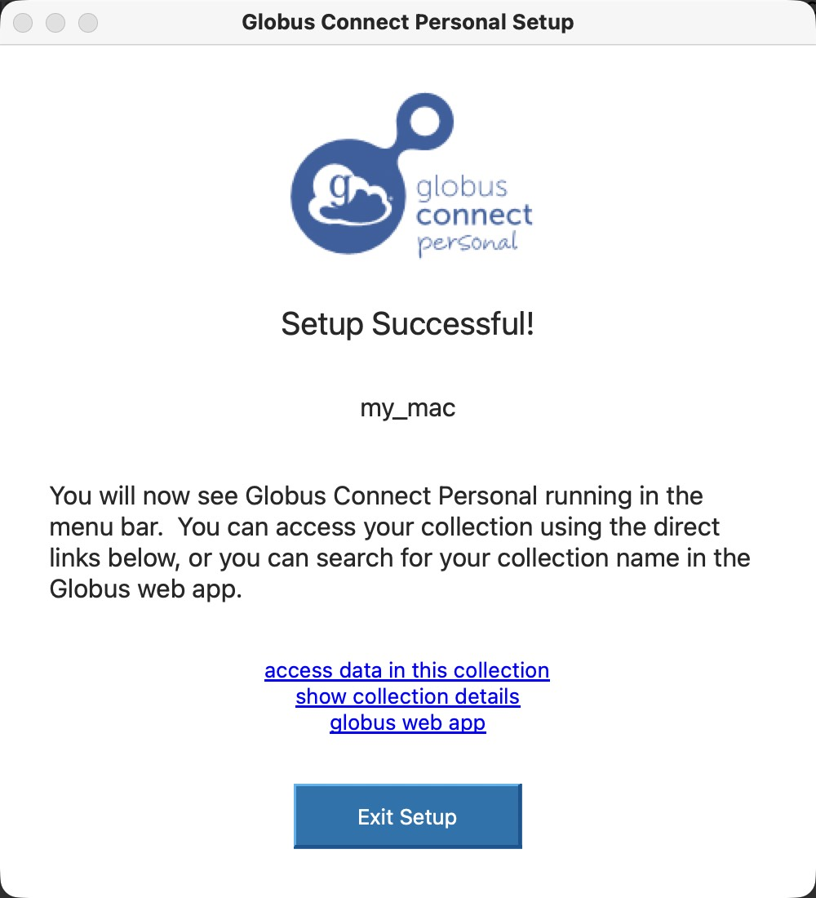
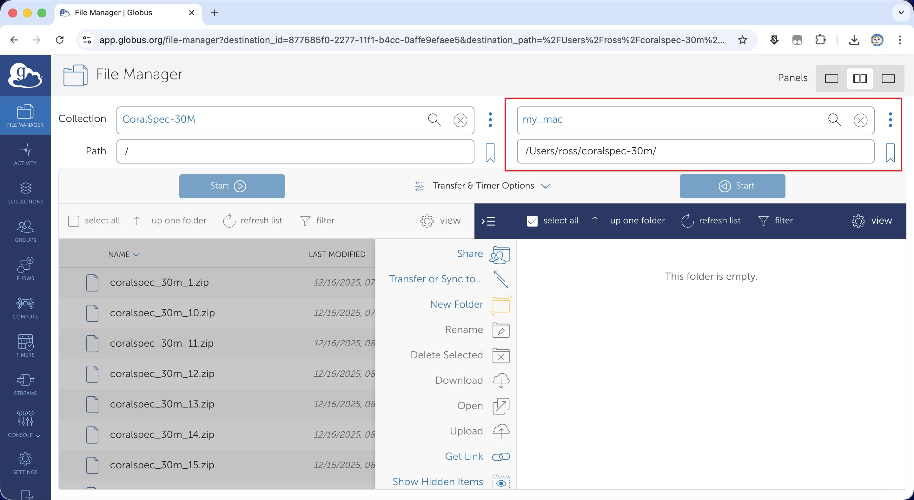
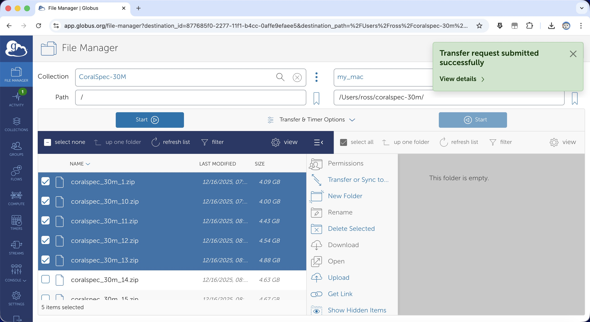
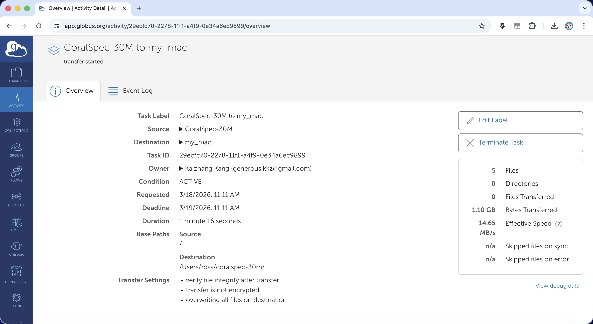

# Dataset Download Instruction

Our dataset is hosted on two sites:

- [KAUST Library (Official)](https://repository.kaust.edu.sa/items/581bd796-dad1-4b44-9fc1-9d1f584e100f)
- [Hugging Face (Mirror)](https://huggingface.co/datasets/cocoakang/CoralSpec-30M)

## Download From KAUST Library

The dataset is hosted on KAUST library and can be downloaded through Globus. Globus is a reliable data transfer service that creates connection between your local machine and the KAUST server.

#### Step 1: Open the KAUST dataset page and click the Globus download link

On the KAUST page, click **Link to Globus download directory**.

#### Step 2: Log in to Globus

If it is the first time you open Globus, you will need to sign in. Here we use google account for demonstration. The dataset has been set to public access.

#### Step 3 (through web browser): Download data (1 file at a time)

Users can directly download one file through the browser, shown as below. However, this method is not recommended for large files or multiple files.

Sometimes Globus asks for an additional identity check for downloading. Please login use the same account to proceed.

After login, you will be redirected to the file download page. 

**Warning 1**: Sometimes due to network issues, the download may fail and pops up an error message as below. In this case, please use Globus Personal Connect for more reliable transfer.

**Warning 2**: This method can only download 1 file at a time. If you check multiple files, then the "Download" button will be disabled. For downloading multiple files, please use Globus Personal Connect.

#### Step 3 (through Globus Personal Connect): Set up Globus Personal Connect

Globus Connect Personal is an official client application to establish connection with your machine and KAUST library and transfer data. Please download and install it on your local machine [here](https://www.globus.org/globus-connect-personal). 

After installation, please login to Globus Connect Personal with the same account you used for the web login. 

After login, you will be asked to set up your local collection. Please provide a name for the collection. 
The default download path is set to home path for the user. You can change it to any folder you want later.  

When the setup is successful, you should see the following message. Keep Globus Connect Personal running to maintain the connection.

#### Step 4: Find your local collection in Globus web app

Go back to the Globus web app, open collection search, and find your local collection (for example `my_mac`).

#### Step 5: Select files and start transfer

Select one or more dataset zip files, then click **Start**.

You should see a transfer request submitted message.

#### Step 8: Monitor progress in Activity

Open **Activity** to monitor running tasks.

Click the task to view details and transfer statistics.

## Download From Hugging Face

The dataset is also mirrored on Hugging Face. You can download the dataset through Hugging Face's web interface.

Once open the Hugging Face dataset page, click the "Files and versions" tab, then click the download icon to download the zip files.

